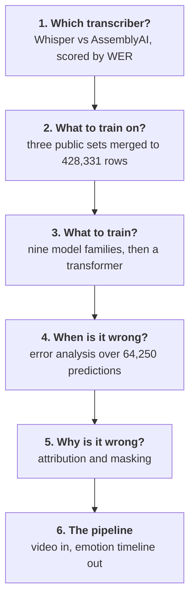

# Emotion Timeline

**Turning a Russian-language video into a per-scene emotion timeline** — and the
dataset, model selection and error analysis that had to happen first.


An exclamation mark, a question mark or a shouted word each take this emotion
classifier from roughly nine-in-ten right to worse than a coin flip. None of them
is a semantic feature. That is the kind of thing you only find by looking at the
6,454 failures rather than the 89.95% accuracy.

[](https://github.com/alex-krasnoshtanov/Emotion-Timeline/actions/workflows/ci.yml)
[](https://www.python.org/downloads/)
[](LICENSE)

Built for the **Content Intelligence Agency**, who make analytics tools for media
producers. They wanted to know where the emotional beats of an episode fall. The
interesting part is not the classifier — it is everything that had to be settled
before the classifier meant anything: which speech-to-text system to trust, what
to train on when no single emotion dataset covers seven classes in two languages,
and which of the model's answers not to believe.

> **Status: rebuild in progress.** This repository is a ground-up rewrite of
> coursework originally done at Breda University of Applied Sciences, September
> to November 2025. Each layer lands as it is finished; see
> [Roadmap](#roadmap) for what is here and what is not. See
> [Credits](#credits) for who wrote what the first time round.

---

## The order things had to happen in



Each stage is a directory under `src/emotion_timeline/`, a chapter under `docs/`,
and a command on the CLI.

---

## Result: which speech-to-text system

The pipeline is only as good as its transcript, so this was settled first. Both
systems transcribed the same 51-minute Russian-language documentary; a human
marked substitutions, insertions and deletions per segment.

| System | WER | Errors | Reference tokens | Segments |
| --- | --- | --- | --- | --- |
| **AssemblyAI Best** | **0.81%** | 17 | 2,101 | 95 |
| Whisper large-v3 | 3.33% | 70 | 2,105 | 241 |

Measured over the same 18.1 minutes, which is as far as the Whisper annotation
runs. The two reference lengths land within four tokens of each other — 2,105
against 2,101 — which is what makes the rates comparable at all. AssemblyAI
makes roughly a quarter as many errors.

### The number that was wrong, and why it matters

The original analysis reported **0.61%** for AssemblyAI. That figure came from
taking the first 240 rows of each spreadsheet — but the two systems segment
differently. Whisper emits 797 segments for this recording where AssemblyAI emits
316, so 240 rows of Whisper is 18.1 minutes of audio and 240 rows of AssemblyAI
is 40.9 minutes — 2,100 reference tokens against 4,884.

The annotation itself is sound and none of it was revisited. What differs is how
far it runs: past the 18-minute mark Whisper has **no annotation at all** (0 of
556 segments carry a marked error) while AssemblyAI was checked through to 38
minutes. So AssemblyAI's extra 23 minutes are real, carefully verified,
low-error audio that Whisper was simply never scored on — and averaging it in
pulled AssemblyAI's rate down.

Restricted to a shared window the answer is 0.81%, not 0.61%. AssemblyAI still
wins comfortably, so the decision that came out of it stands — but the margin was
overstated by a third. The fix is a summation rule, not a re-judgement:
`compare()` in
[`stt/wer.py`](src/emotion_timeline/stt/wer.py) now takes a time window rather
than a row count, and a test asserts the row-count version is wrong, so the
mistake cannot come back.

```bash
uv run emotion-timeline wer --window 0:00-18:09
```

Full write-up: [`docs/stt-benchmark.md`](docs/stt-benchmark.md).

---

## Result: where the classifier fails

Accuracy of **89.95%** over 64,250 held-out samples, and the interesting part is
the 6,454 failures.


| Hardest class | Error rate | Support |
| --- | --- | --- |
| Neutral | 36.77% | 2,010 |
| Fear | 24.87% | 8,003 |
| Surprise | 22.68% | 2,372 |

Difficulty mostly tracks rarity — except Fear, which fails a quarter of the time
on the third-largest class in the set. Its errors scatter across four
neighbouring emotions rather than concentrating on one, which is what genuine
ambiguity looks like as opposed to a shortage of data.

Confidence separates cleanly on average, 0.887 when right against 0.428 when
wrong, but **625 errors are made confidently** — 9.7% of them, and precisely the
ones a confidence threshold will never catch.

```bash
uv run emotion-timeline errors
```

Full write-up: [`docs/error-analysis.md`](docs/error-analysis.md).

### These figures come from recorded statistics, not raw predictions

The 64,250 per-sample predictions were not kept, so the charts are rendered from
a committed summary rather than recomputed. That is weaker, so everything that
can be cross-checked is: supports sum, errors sum, every rate matches its own
numerator and denominator, and `emotion-timeline figures` refuses to draw
anything if they do not. The strongest check is external — the model card written
separately for the same split records per-class *recall* where this records
per-class *error rate*, and the two agree to four decimal places across all seven
classes.

---

## Why word error rate is recomputed and not aligned

The annotations are hand-counted per segment and the data holds no reference
transcript, so WER cannot be derived by aligning two strings. It is recombined
from the counts instead, which means the reference length has to be recovered:

```
N_ref = N_hypothesis + deletions − insertions
WER   = (S + I + D) / N_ref
```

A deletion is a reference word the system dropped, so it is missing from the
hypothesis and is added back; an insertion is the reverse. This is the one place
the arithmetic is not obvious, and `tests/test_wer.py` pins it.

---

## Quick start

[uv](https://docs.astral.sh/uv/) is the shortest path in:

```bash
git clone https://github.com/alex-krasnoshtanov/Emotion-Timeline
cd Emotion-Timeline
uv sync --extra dev
uv run pytest
```

The core install is deliberately light — numpy, pandas, matplotlib, scipy. Nothing
that needs a GPU or a paid API key is a required dependency, so reading the
results costs a few seconds rather than a torch download. The heavier pieces are
extras: `--extra stt` for the transcriber adapters, `--extra model` for training,
`--extra demo` for the browser demo.

pip works too: `pip install -e ".[dev]"`.

### Working on it

```bash
uv run pre-commit install --install-hooks --hook-type pre-push
```

That is the whole setup. Formatting, linting, strict type checking and the guard
against committing client material or model weights then run before a commit
exists, and the test suite runs before a push. CI enforces the same set — its
lint job *is* `pre-commit run --all-files` — so a green commit hook means a green
pull request.

Tests carry a 95% coverage floor. It is not a quality score: rendering a result
is easy and verifying one is easy to skip, and everything this repository claims
rests on its numbers being checked.

---

## Repository layout

```
benchmarks/stt/          the annotated transcripts both WER numbers come from
src/emotion_timeline/
  stt/                   transcriber adapters + the WER harness
  analysis/              error analysis over model predictions
benchmarks/error-analysis/  the recorded statistics the figures render from
assets/                  figures, regenerated by `emotion-timeline figures`
docs/                    one chapter per stage
tests/                   the arithmetic, and the mistakes worth pinning
```

---

## Roadmap

- [x] Speech-to-text benchmark, with the window bug fixed and pinned
- [x] Error analysis: 64,250 predictions, four figures, cross-checked
- [ ] Dataset build: three public sources merged and reconciled to seven classes
- [ ] Model selection: nine families compared on one feature pipeline
- [ ] Fine-tuned transformer, weights as a release asset with a recorded digest
- [ ] Explainability: attribution and masking robustness
- [ ] Prompted-LLM baseline
- [ ] The nine-stage pipeline, containerised
- [ ] Browser demo

---

## Credits

A rewrite of a university project, and several of the ideas here were not mine
first. The original group repository was a five-person effort:

| What | Originally by |
| --- | --- |
| Transcription pipeline, scene alignment, the end-to-end system | Oleksii Krasnoshtanov |
| Dataset construction, error analysis, the speech-to-text comparison | Oleksii Krasnoshtanov |
| Nine-family model comparison and its iteration log | Danil Sysenko |
| Explainability analysis — attribution and masking | Filipp Lotsmanov |
| Prompted-LLM baseline and prompt engineering | the group |

Everything in this repository is rewritten rather than copied, and the numbers are
re-derived rather than quoted — which is how the speech-to-text discrepancy above
came to light.

---

## Licence

MIT — see [LICENSE](LICENSE).

The datasets used for training are third-party and carry their own terms:
[GoEmotions](https://github.com/google-research/google-research/tree/master/goemotions),
[cirimus/super-emotion](https://huggingface.co/datasets/cirimus/super-emotion) and
[Djacon/ru-izard-emotions](https://huggingface.co/datasets/Djacon/ru-izard-emotions).
Neither the training corpus nor any client material is redistributed here; the
dataset is rebuilt from source.

---

## Author

**Oleksii Krasnoshtanov** — [GitHub](https://github.com/alex-krasnoshtanov) ·
[LinkedIn](https://www.linkedin.com/in/oleksii-krasnoshtanov/)
