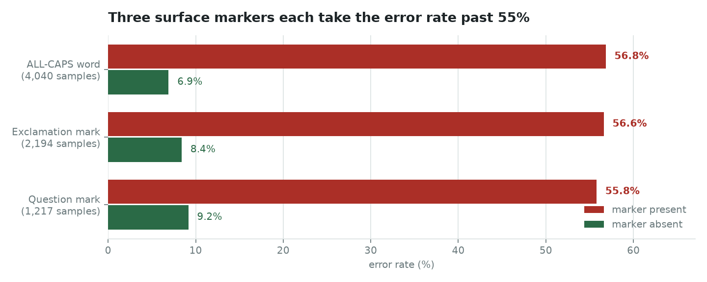
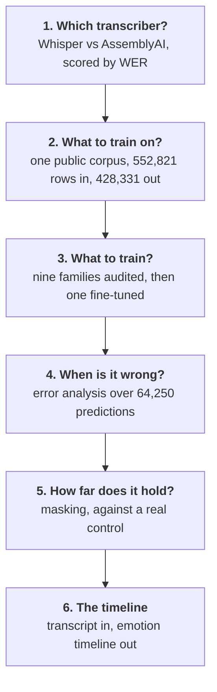
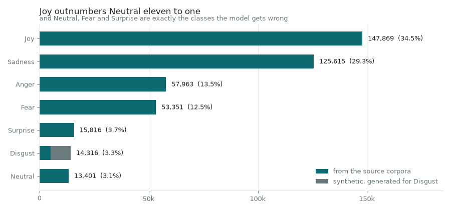
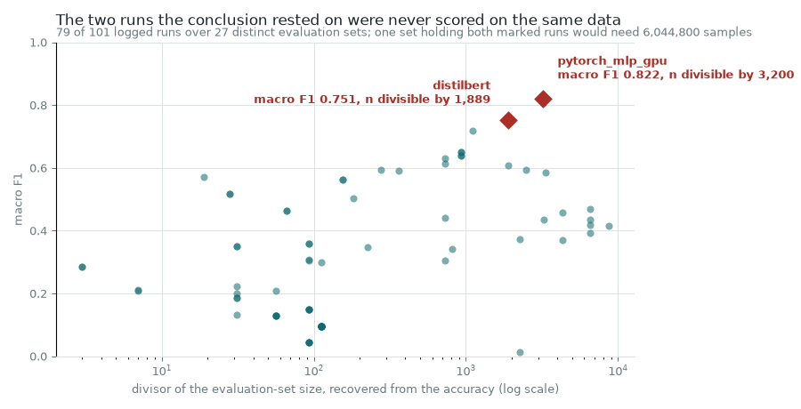
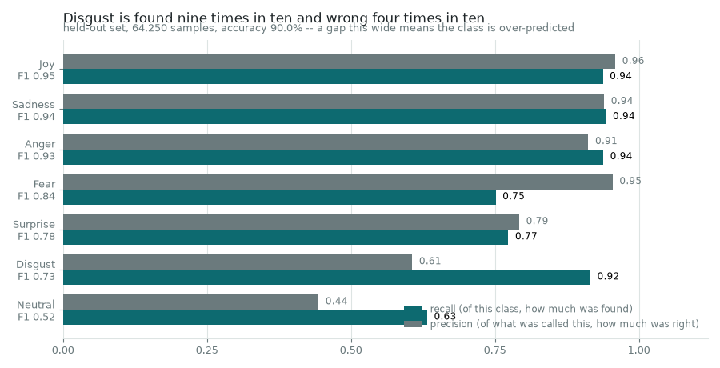
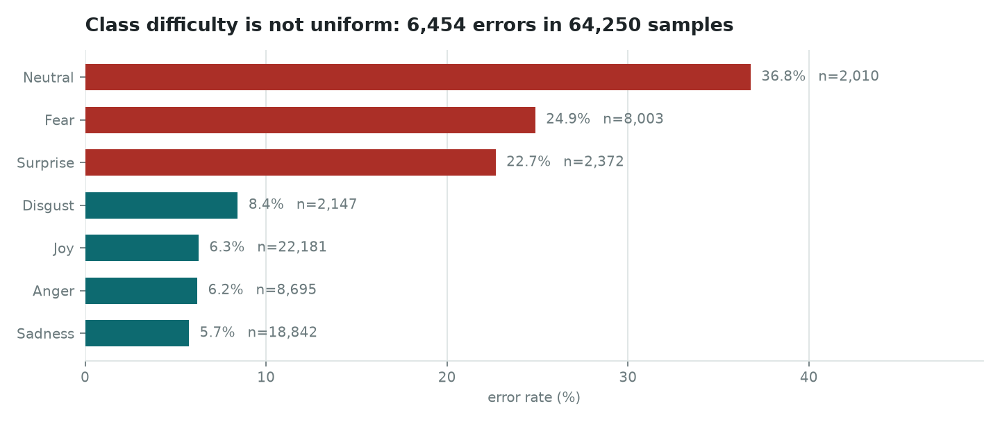

# Emotion Timeline

**Turning a Russian-language video into a per-scene emotion timeline** — and the
dataset, model selection and error analysis that had to happen first.



An exclamation mark, a question mark or a shouted word each take this emotion
classifier from roughly nine-in-ten right to worse than a coin flip. None of them
is a semantic feature. That is the kind of thing you only find by looking at the
6,454 failures rather than the 89.95% accuracy.

[](https://github.com/alex-krasnoshtanov/Emotion-Timeline/actions/workflows/ci.yml)
[](https://www.python.org/downloads/)
[](LICENSE)

Built for the **Content Intelligence Agency**, who make analytics tools for media
producers. They wanted to know where the emotional beats of an episode fall. The
interesting part is not the classifier — it is everything that had to be settled
before the classifier meant anything: which speech-to-text system to trust, what
to train on when no single emotion dataset covers seven classes in two languages,
and which of the model's answers not to believe.

> A ground-up rewrite of coursework originally done at Breda University of
> Applied Sciences, September to November 2025. [Scope](#scope) says what this
> covers and what it leaves out on purpose; [Credits](#credits) says who wrote
> what the first time round.

---

## The order things had to happen in



Each stage is a directory under `src/emotion_timeline/`, a chapter under `docs/`,
and a command on the CLI.

---

## Result: which speech-to-text system

The pipeline is only as good as its transcript, so this was settled first. Both
systems transcribed the same 51-minute Russian-language documentary; a human
marked substitutions, insertions and deletions per segment.

| System | WER | Errors | Reference tokens | Segments |
| --- | --- | --- | --- | --- |
| **AssemblyAI Best** | **0.81%** | 17 | 2,101 | 95 |
| Whisper large-v3 | 3.33% | 70 | 2,105 | 241 |

Measured over the same 18.1 minutes, which is as far as the Whisper annotation
runs. The two reference lengths land within four tokens of each other — 2,105
against 2,101 — which is what makes the rates comparable at all. AssemblyAI
makes roughly a quarter as many errors.

### The number that was wrong, and why it matters

The original analysis reported **0.61%** for AssemblyAI. That figure came from
taking the first 240 rows of each spreadsheet — but the two systems segment
differently. Whisper emits 797 segments for this recording where AssemblyAI emits
316, so 240 rows of Whisper is 18.1 minutes of audio and 240 rows of AssemblyAI
is 40.9 minutes — 2,100 reference tokens against 4,884.

The annotation itself is sound and none of it was revisited. What differs is how
far it runs: past the 18-minute mark Whisper has **no annotation at all** (0 of
556 segments carry a marked error) while AssemblyAI was checked through to 38
minutes. So AssemblyAI's extra 23 minutes are real, carefully verified,
low-error audio that Whisper was simply never scored on — and averaging it in
pulled AssemblyAI's rate down.

Restricted to a shared window the answer is 0.81%, not 0.61%. AssemblyAI still
wins comfortably, so the decision that came out of it stands — but the margin was
overstated by a third. The fix is a summation rule, not a re-judgement:
`compare()` in
[`stt/wer.py`](src/emotion_timeline/stt/wer.py) now takes a time window rather
than a row count, and a test asserts the row-count version is wrong, so the
mistake cannot come back.

```bash
uv run emotion-timeline wer --window 0:00-18:09
```

Full write-up: [`docs/stt-benchmark.md`](docs/stt-benchmark.md).

---

## Result: what the classifier was trained on

428,331 rows, seven classes, assembled from one public corpus because no single
dataset covers seven emotions in the register this needed - television dialogue,
not product reviews.



Building it discards roughly a quarter of the source corpus, and the largest
single loss is the one worth explaining. **34,940 rows labelled Love** were
dropped for having no seven-class equivalent. The original build meant to
relabel them and relabelled none of them: the lookup was keyed by the capitalised
class names while the source annotations are lowercase and fine-grained, so
nothing ever matched. Fixing the case would not have saved them either, because
`love` has no seven-class target to be relabelled to. A fourteenth of the data
went, and saying so is more useful than a round number.

```bash
uv run emotion-timeline dataset          # the recorded build, from committed data
uv run emotion-timeline build-dataset    # rerun it (needs --extra data)
```

Running the build reproduces **all seven published class counts exactly**, and
the whole funnel bar a single text that deduplication removes here and the length
filter removes in the original - both discard it, so nothing downstream differs.

### The 15% that ties this to the error analysis

The error report records an evaluation over 64,250 samples and says nothing about
where they came from. This record says the training set holds 428,331 rows and
says nothing about any evaluation. They were written months apart, and 15% of the
second is the first - exactly in total, and within one row in every one of the
seven classes.

Neither is derivable from the other, so their agreeing is the evidence that the
two chapters describe the same model. It is also the only such evidence there is,
because the raw predictions are gone.

### One bug, reproduced on purpose

`:/` is on the emoticon list and emoticons are stripped before URLs are masked,
so `https://` loses its `://` and stops matching the URL pattern. Of 1,857 texts
containing a URL, **199** are still recognisable as one by the time `[URL]`
masking runs. The published model was trained on data with that in it, so the
build reproduces it rather than quietly improving on it.

Full write-up: [`docs/dataset.md`](docs/dataset.md).

---

## Result: which model family — and a benchmark withdrawn

Nine families were compared before a classifier was picked: logistic regression,
naive Bayes, SVM, RNN, GRU, LSTM, MLP, DistilBERT and XLM-RoBERTa. Two records of
that comparison survive — eight rows submitted by hand, and 101 runs the training
script logged as it went — and they disagree about which family won.



```bash
uv run emotion-timeline models      # the audit, from both records
```

The conclusion drawn at the time was that a feature-engineered MLP beat every
transformer, macro F1 **0.8219** against **0.7515**. That is what sorting the run
log gives you, and it compares two runs that were never scored on the same data.
Neither log records an evaluation size, so it has to be recovered: an accuracy is
whole correct over whole samples, so its fraction in lowest terms carries a
divisor of the set it was measured on. The MLP's needs a multiple of **3,200** and
DistilBERT's a multiple of **1,889**, which is prime. One evaluation set behind
both would hold **6,044,800 samples** — fourteen times this project's entire
training set.

It is not sampling noise either, and reaching for that would be the easy answer.
The 95% Wilson intervals are [0.8530, 0.8767] and [0.7692, 0.8061] and they do
not overlap. Something real separates the two runs; since they share no
evaluation set, it is what they were scored on.

Two more things fall out of the same two files:

- **A sixth of the benchmark is models that learned nothing.** Predict one class
  for every input and both F1 scores follow from the accuracy alone — 57 correct
  of 112 gives macro F1 114/1183 = 0.096365173 exactly. **17 of the 101 runs**
  match that closed form to all nine decimal places they were logged with, and
  twelve of them share one triple of scores across naive Bayes, an LSTM, an RNN
  and XLM-RoBERTa. Four architectures cannot agree to nine decimals unless they
  answered identically.
- **Below the top two, the ranking is a choice of average.** The submitted log
  reported weighted F1 and recorded macro F1 in the same row. The GRU is sixth on
  one and third on the other; the linear SVC is fifth on one and second-worst on
  the other.

What survives is narrow and worth stating plainly: on the one record where the
models shared a corpus, a transformer wins on both averages. That record has no
test split and gave its four classical models nearly twice as much Neutral as its
four neural ones, so it points the right way and settles nothing.

Full write-up, including why nothing here was rerun:
[`docs/model-selection.md`](docs/model-selection.md).

---

## Result: the model, and two records that disagree about it

The classifier's weights are gone from both university repositories. Two records
of it survive, and they describe different models: the group's model card claims
DeBERTa-V2-Base evaluated single-label, and the committed training script is
DistilBERT evaluated multi-label.



**What holds up.** Every figure in all three of the card's evaluation tables
reproduces — each per-class F1 is the harmonic mean of its own precision and
recall, each macro average the plain mean of its column, accuracy and weighted F1
from the support column. Eighteen class rows, three tables, four decimal places.
The in-domain result of **89.95% accuracy / 0.8127 macro F1** stands on its own
arithmetic, and its support column is 15% of the dataset build, class by class.

```bash
uv run emotion-timeline model
```

**What tells the two records apart.** For single-label classification micro F1
and accuracy are the same quantity; the card reports both as 0.8995. The script
reports micro F1 0.8724 against subset accuracy 0.8279, which single-label
evaluation cannot produce. And solving the script's hamming loss for the average
true labels per sample gives **1.025** — so it trained on the pre-collapse
multi-label file, not the single-label dataset the card names. The one tokenizer
that survived the run holds **30,522 WordPiece tokens**, exactly DistilBERT's;
the card claims 128,100 SentencePiece, which is DeBERTa-V2's.

**The card's dataset table has its labels on the wrong rows.** The counts are
right — they are the state this repository's build passes through before the
priority collapse — but four of seven labels are shifted. Joy's 149,321 rows are
called Neutral; Neutral's 13,401 are called Fear. The card refutes itself: its
own support column gives Neutral 2,010, which is 15% of 13,401 and not of
149,321.

That is not cosmetic. The card's limitations section reasons from the broken
table and concludes the data is *"skewed toward neutral"* — Neutral is the
**smallest** class at 3.1%, and the one the model is worst at. The error
diagnosis inverts the actual problem, and the plan this rebuild was written from
quoted the same broken distribution.

**The stress test cannot be read as a robustness result.** Its macro average
divides by six, not seven — Surprise is missing from the table. Its control group
is *harder* than three of the categories built to break the model: control
0.3147 against emoji-heavy 0.7273 and typos 0.7287. And the headline 31.44% is
just the control's own score, because the control is 3,502 of the 5,000 samples.
Three categories score exactly 0.0000 over 561 samples, where uniform guessing
would land near one in seven.

Full write-up: [`docs/model.md`](docs/model.md).

---

## Result: a model that exists

Every section above audits a record whose artefact is gone. This one trains a
classifier on the dataset rebuilt above, keeps everything it predicted, and
measures it against the card the section before takes apart.

```bash
uv run emotion-timeline training      # reads only committed records
```

DistilBERT on 293,426 rows, three epochs, 11.6 minutes on an RTX 5070. Over
62,877 held-out rows: **accuracy 0.9164**, macro F1 0.8088, weighted F1 0.9164.
The card reports 0.8995 and 0.8127 over its own 64,250.

| Class | Card | Here | |
| --- | ---: | ---: | ---: |
| Neutral | 0.5215 | **0.5636** | +0.0421 |
| Anger | 0.9250 | **0.9370** | +0.0120 |
| Sadness | 0.9412 | **0.9525** | +0.0113 |
| Joy | 0.9481 | **0.9587** | +0.0106 |
| Fear | 0.8407 | **0.8495** | +0.0088 |
| Surprise | 0.7826 | 0.7784 | −0.0042 |
| Disgust | 0.7296 | — | not comparable |

**Accuracy up, macro F1 down, and the whole of the difference is Disgust.** Macro
averaging weights it like Joy, and 9,151 of the card's 14,316 Disgust rows are the
synthetic file that did not survive — 64% of the class. So no Disgust comparison
is published, and that is enforced in code rather than footnoted: the command
prints a reason where the number would go, and a test asserts it never prints one.

### The finding that reproduces on a model that exists

The error analysis above was of a model nobody has. Its central result holds here
on one that does:

| Marker | Error rate with | without |
| --- | ---: | ---: |
| ALL-CAPS word | 52.10% | 7.84% |
| Question mark | 51.84% | 7.53% |
| Exclamation mark | 50.10% | 6.94% |

Two fine-tunes, months apart, on data one of them cannot fully reproduce, and
three pieces of typography still take the model from nine-in-ten right to worse
than a coin flip.

### Two questions the earlier chapters left open

**Calibration.** The model is overconfident. One temperature of 1.499, fitted on
validation and applied to the held-out set, cuts expected calibration error from
0.0245 to 0.0074 and cannot change accuracy at all. A threshold is still not a
fix: 1,448 of the 5,254 errors are made at 0.7 or above.

**The URL bug.** The dataset chapter reproduces a bug that strips `://` out of
URLs before masking, and says its effect "belongs with a retrain". The 244
held-out rows carrying a mangled `http/` fragment are wrong **47.13%** of the
time against 8.20% elsewhere. Whether the mangling is the cause stays open: only
12 rows reached `[URL]` masking intact, far too few to compare against.

Full chapter: [`docs/fine-tune.md`](docs/fine-tune.md).

---

## Result: where the classifier fails

Accuracy of **89.95%** over 64,250 held-out samples, and the interesting part is
the 6,454 failures.



| Hardest class | Error rate | Support |
| --- | --- | --- |
| Neutral | 36.77% | 2,010 |
| Fear | 24.87% | 8,003 |
| Surprise | 22.68% | 2,372 |

Difficulty mostly tracks rarity — except Fear, which fails a quarter of the time
on the third-largest class in the set. Its errors scatter across four
neighbouring emotions rather than concentrating on one, which is what genuine
ambiguity looks like as opposed to a shortage of data.

Confidence separates cleanly on average, 0.887 when right against 0.428 when
wrong, but **625 errors are made confidently** — 9.7% of them, and precisely the
ones a confidence threshold will never catch.

```bash
uv run emotion-timeline errors
```

Full write-up: [`docs/error-analysis.md`](docs/error-analysis.md).

### These figures come from recorded statistics, not raw predictions

The 64,250 per-sample predictions were not kept, so the charts are rendered from
a committed summary rather than recomputed. That is weaker, so everything that
can be cross-checked is: supports sum, errors sum, every rate matches its own
numerator and denominator, and `emotion-timeline figures` refuses to draw
anything if they do not. The strongest check is external — the model card written
separately for the same split records per-class *recall* where this records
per-class *error rate*, and the two agree to four decimal places across all seven
classes.

---

## Why word error rate is recomputed and not aligned

The annotations are hand-counted per segment and the data holds no reference
transcript, so WER cannot be derived by aligning two strings. It is recombined
from the counts instead, which means the reference length has to be recovered:

```
N_ref = N_hypothesis + deletions − insertions
WER   = (S + I + D) / N_ref
```

A deletion is a reference word the system dropped, so it is missing from the
hypothesis and is added back; an insertion is the reverse. This is the one place
the arithmetic is not obvious, and `tests/test_wer.py` pins it.

---

## Quick start

[uv](https://docs.astral.sh/uv/) is the shortest path in:

```bash
git clone https://github.com/alex-krasnoshtanov/Emotion-Timeline
cd Emotion-Timeline
uv sync --extra dev
uv run pytest
```

The core install is deliberately light — numpy, pandas, matplotlib, scipy. Nothing
that needs a GPU or a paid API key is a required dependency, so reading the
results costs a few seconds rather than a torch download. The heavier pieces are
extras: `--extra data` to rebuild the training set from source, `--extra model`
to fine-tune or run the classifier.

pip works too: `pip install -e ".[dev]"`.

### Working on it

```bash
uv run pre-commit install --install-hooks -t pre-commit -t pre-push
```

That is the whole setup. Formatting, linting, strict type checking and the guard
against committing client material or model weights then run before a commit
exists, and the test suite runs before a push. CI enforces the same set — its
lint job *is* `pre-commit run --all-files` — so a green commit hook means a green
pull request.

### Credentials

There are none to configure. The source corpus is public and ungated and every
published number derives from files under `benchmarks/`, so the whole study
reproduces with no account anywhere — a test asserts it, running each command
with the environment stripped.

For the stages that will call a hosted service, keys come from the environment
or a gitignored `.env`; `cp .env.example .env` and fill in what you need. An
exported variable always wins over the file. A `no-credentials` pre-commit hook
refuses anything shaped like a token, because the coursework this rebuilds
carried a live one in a notebook for a year.

Tests carry a 95% coverage floor. It is not a quality score: rendering a result
is easy and verifying one is easy to skip, and everything this repository claims
rests on its numbers being checked.

---

## Repository layout

```
benchmarks/stt/          the annotated transcripts both WER numbers come from
benchmarks/error-analysis/  the recorded statistics the figures render from
benchmarks/dataset/      the recorded build: every row count, every class
benchmarks/model-selection/  both surviving records of the nine-family benchmark
benchmarks/model/        both surviving records of the trained classifier
src/emotion_timeline/
  stt/                   the word error rate harness
  analysis/              error analysis over model predictions
  data/                  dataset construction from the public corpus
  selection/             the audit of the inherited model comparison
  model/                 the trained classifier's two records, audited
  figures.py             one palette, one staleness check, shared by every stage
assets/                  figures, regenerated by `emotion-timeline figures`
docs/                    one chapter per stage
tests/                   the arithmetic, and the mistakes worth pinning
```

---

## Scope

Five stages are in. Each one commits the inputs it derives from, recomputes its
numbers from a command, and ends its chapter by saying what it does not establish.

| Stage | Command | Chapter |
| --- | --- | --- |
| Which speech-to-text system | `wer` | [stt-benchmark.md](docs/stt-benchmark.md) |
| What it was trained on | `dataset`, `build-dataset` | [dataset.md](docs/dataset.md) |
| Which model family | `models` | [model-selection.md](docs/model-selection.md) |
| The trained classifier's records | `model` | [model.md](docs/model.md) |
| Where it fails | `errors` | [error-analysis.md](docs/error-analysis.md) |
| A model that exists | `split`, `fine-tune`, `summarise`, `training` | [fine-tune.md](docs/fine-tune.md) |

**Still open.** A per-scene timeline over the transcript this repository already
commits, which is the thing the title promises and the one stage that would tie
the others together in a picture. The nine families rerun on one feature pipeline
and one held-out split is the other, and the only thing that would repair the
ranking withdrawn above.

**Deliberately absent.**

- **No attribution analysis.** Attribution maps have no ground truth to be
  checked against, and the rule here is that every published number is
  reproducible or cross-checked. Masking robustness measures accuracy deltas, so
  that half stays in scope.
- **No prompted-LLM baseline.** It was the group's work, none of its prompts or
  predictions survive to reproduce it from, and adding it would mean this study
  needs an API key. It currently needs none, and
  `test_no_committed_command_requires_a_credential` keeps it that way.
- **No video-ingest pipeline.** The timeline runs over a committed, timestamped
  transcript, so download, scene detection and audio preprocessing would buy a
  reader nothing and cost several hundred megabytes of media.
- **No Docker image and no docs site.**
  [Detection-by-Shadow](https://github.com/alex-krasnoshtanov/Detection-by-Shadow)
  carries the container and the browser demo;
  [DSL-Learning](https://github.com/alex-krasnoshtanov/DSL-Learning) carries the
  mkdocs site. This repository is the study, and it installs in a few seconds.

---

## Credits

A rewrite of a university project, and several of the ideas here were not mine
first. The original group repository was a five-person effort:

| What | Originally by |
| --- | --- |
| Transcription pipeline, scene alignment, the end-to-end system | Oleksii Krasnoshtanov |
| Dataset construction, error analysis, the speech-to-text comparison | Oleksii Krasnoshtanov |
| Nine-family model comparison and its iteration log | Danil Sysenko |
| Explainability analysis — attribution and masking | Filipp Lotsmanov |
| Prompted-LLM baseline and prompt engineering | the group |

Everything in this repository is rewritten rather than copied, and the numbers are
re-derived rather than quoted. That is how the speech-to-text discrepancy above
came to light, and how the model-selection ranking came to be withdrawn — both
findings are about the records rather than about the people who kept them, and
neither would have surfaced from quoting the figures forward.

---

## Licence

MIT — see [LICENSE](LICENSE).

The training set is rebuilt from one third-party corpus, which carries its own
terms: [cirimus/super-emotion](https://huggingface.co/datasets/cirimus/super-emotion).
It bundles six source corpora, and the 1,013 rows this build keeps from its
GoEmotions portion additionally carry
[GoEmotions](https://github.com/google-research/google-research/tree/master/goemotions)'
terms. Neither the training corpus nor any client material is redistributed here;
the dataset is rebuilt from source.

---

## Author

**Oleksii Krasnoshtanov** — [GitHub](https://github.com/alex-krasnoshtanov) ·
[LinkedIn](https://www.linkedin.com/in/oleksii-krasnoshtanov/)
