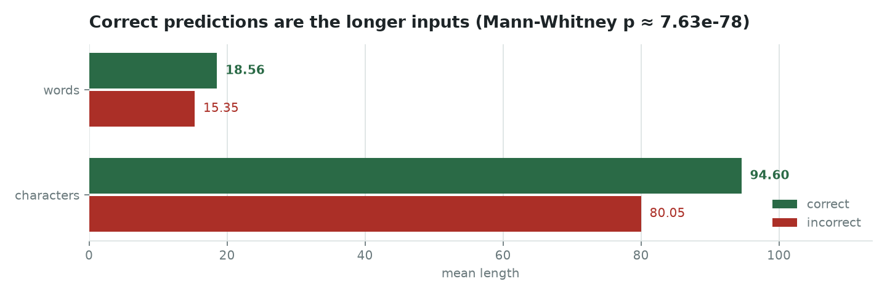
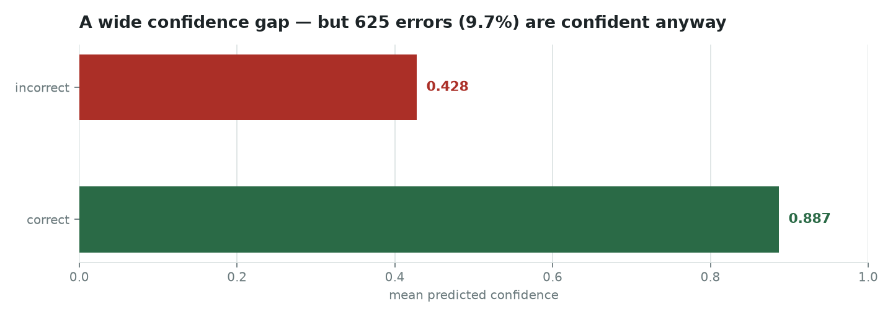

# Where the classifier goes wrong

Accuracy of 89.95% over 64,250 held-out samples says almost nothing useful on its
own. The 6,454 failures are not spread evenly, and the pattern in them is sharp
enough to act on.

```bash
uv run emotion-timeline errors
```

## Three surface markers predict failure better than anything semantic


| Marker | Error rate with | without | Multiplier | Samples |
| --- | --- | --- | --- | --- |
| ALL-CAPS word | 56.83% | 6.91% | **8.2x** | 4,040 |
| Exclamation mark | 56.61% | 8.40% | **6.7x** | 2,194 |
| Question mark | 55.79% | 9.16% | **6.1x** | 1,217 |
| Ellipsis | 14.29% | 10.04% | 1.4x | 7 |

A shouted word, an exclamation mark or a question mark each take the model from
roughly nine-in-ten right to worse than a coin flip. None of these is a semantic
feature — they are typography. The model has learned to associate emphasis with
emotion, and emphatic text is exactly where the label is most contested.

The ellipsis row is here because leaving it out would be selective. With seven
samples it carries no weight.

## Class difficulty tracks rarity, with one exception


Neutral is the worst class at 36.77%, on the smallest support (2,010). That is
the expected shape — but Fear breaks it, failing 24.87% of the time on 8,003
samples, the third-largest class. Fear is not rare; it is genuinely ambiguous.
Its errors scatter across Sadness (535), Neutral (383), Disgust (316) and
Surprise (315) rather than concentrating on one neighbour.

Joy, Anger and Sadness sit between 5.7% and 6.3%. The single largest confusion in
the matrix is Joy read as Neutral, 638 cases: cheerful but factual sentences
carrying no affect word.

Neutral is also the category everything else falls into when the model is unsure,
which is why a class holding 3% of the data absorbs so many mistakes.

## Longer inputs are easier



Correct predictions average 94.60 characters and 18.56 words; incorrect ones
average 80.05 and 15.35. Mann–Whitney U is 2.129e8 at p ≈ 7.63e-78 — a gap that
is small in absolute terms and unarguable in significance, which is what 64,250
samples buys.

Short text is context-poor, and short emphatic text is both context-poor and
typographically loud, so the two findings compound.

## Confidence separates well, and 625 errors ignore that



Mean confidence is 0.887 when the model is right and 0.428 when it is wrong —
wide enough to threshold on. But 625 errors, 9.68% of all of them, are made
confidently. Those are the ones a confidence filter will never catch, and the
reason a threshold is a mitigation rather than a fix.

## What follows from this

- **Normalise emphasis before inference**, and keep it as an explicit feature
  rather than discarding it: case-fold ALL-CAPS, collapse repeated punctuation,
  and pass a flag saying emphasis was present.
- **Reweight Neutral, Fear and Surprise** in training, or mine hard negatives
  from the Joy–Neutral and Fear–Sadness pairs specifically.
- **Calibrate rather than threshold** — temperature scaling or isotonic
  regression with per-class cut-offs, because one global threshold cannot serve a
  model whose per-class error rates span 5.7% to 36.8%.
- **Route low-margin predictions to review** where the decision matters.

## Provenance, and why these are rendered from a summary

The 64,250 per-sample predictions were not kept. What survives is the recorded
summary in `benchmarks/error-analysis/held-out-64250.json`, and the figures above
are rendered from it rather than recomputed from raw output.

That is weaker than re-deriving them, so everything that can be cross-checked is.
`check_consistency()` verifies the per-class supports sum to 64,250, the
per-class errors sum to 6,454, and every rate matches its own numerator and
denominator. `emotion-timeline figures` refuses to draw anything if any of that
fails.

The strongest check is external. The model card, written separately for the same
split, records per-class **recall**; this report records per-class **error rate**.
They are the same measurement from opposite directions, and they agree to four
decimal places across all seven classes —
`test_class_error_rates_match_the_model_card_recalls` asserts it.
