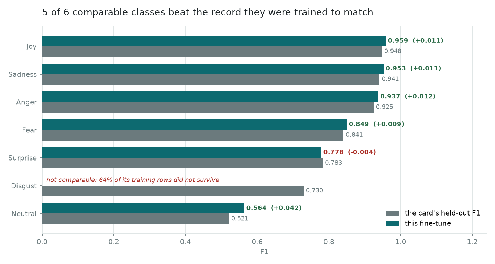

# A model that exists

Every other chapter here audits a record whose artefact is gone. This one trains
a classifier on the dataset [`dataset.md`](dataset.md) rebuilds, keeps everything
it predicted, and measures it against the card that
[`model.md`](model.md) takes apart.

```bash
uv run emotion-timeline training      # reads only committed records
```

The comparison is possible at all because the split lands on the inherited
evaluation. Five of its seven per-class supports are the card's own, to the row.

## What was trained

`distilbert-base-uncased`, seven classes, single-label. The architecture is not a
guess and it is not a judgement: the one thing that survives of the original
training run is a 30,522-token vocabulary, which is exactly this checkpoint's.
[`model.md`](model.md) declines to say whether that or the card's DeBERTa-V2
claim is the wrong record, and **nothing here settles it either** — training the
architecture the surviving evidence points at makes two tables worth putting side
by side, and no more than that.

| | |
| --- | --- |
| Rows | 293,426 train / 62,877 validation / 62,877 held out |
| Schedule | 3 epochs, batch 64, lr 5e-5, linear warmup then decay, bf16 |
| Hardware | RTX 5070, 11.6 minutes |
| Seed | 20251115, and the split is derived from it |

Validation accuracy by epoch: **0.9133, 0.9168, 0.9160**. It had stopped
improving by the second. That is a small thing and it is the sort of thing the
inherited record cannot say about itself, because nothing recorded its epochs.

## The result

**Accuracy 0.9164 over 62,877 held-out rows. Macro F1 0.8088, weighted F1 0.9164.**

| Class | Support | Precision | Recall | F1 |
| --- | ---: | ---: | ---: | ---: |
| Joy | 22,180 | 0.9536 | 0.9639 | 0.9587 |
| Sadness | 18,842 | 0.9568 | 0.9483 | 0.9525 |
| Anger | 8,695 | 0.9335 | 0.9405 | 0.9370 |
| Fear | 8,003 | 0.8490 | 0.8499 | 0.8495 |
| Surprise | 2,372 | 0.8186 | 0.7420 | 0.7784 |
| Neutral | 2,010 | 0.5587 | 0.5687 | 0.5636 |
| Disgust | 775 | 0.6069 | 0.6374 | 0.6218 |

## Against the card, class by class



The card reports 0.8995 accuracy and 0.8127 macro F1 over its own 64,250 rows.

| Class | Card | Here | |
| --- | ---: | ---: | ---: |
| Neutral | 0.5215 | **0.5636** | +0.0421 |
| Anger | 0.9250 | **0.9370** | +0.0120 |
| Sadness | 0.9412 | **0.9525** | +0.0113 |
| Joy | 0.9481 | **0.9587** | +0.0106 |
| Fear | 0.8407 | **0.8495** | +0.0088 |
| Surprise | 0.7826 | 0.7784 | −0.0042 |
| Disgust | 0.7296 | — | not comparable |

Five of six comparable classes ahead, one fractionally behind.

### Accuracy is up and macro F1 is down, and that is one fact

0.9164 against 0.8995, and 0.8088 against 0.8127. Both, at once, and the whole of
the difference is Disgust. Macro averaging gives Disgust the same weight as Joy,
and **9,151 of the card's 14,316 Disgust rows are the synthetic file that did not
survive** — 64% of the class. This model saw 5,165 where the card's saw 14,316,
and scores 0.6218 where the card scores 0.7296.

So no Disgust comparison is published. That is enforced rather than footnoted:
`compare_to_card()` returns no number for it and a reason instead, and
`test_nothing_the_command_prints_puts_a_delta_beside_disgust` asserts the command
never prints one. A caveat under a table gets read second; a number that does not
exist cannot be misread at all.

### Neutral gaining most is the interesting one

Neutral is the class the error analysis called the model's worst, and the class
the card's **mislabelled dataset table** blamed the whole problem on — it called
Joy's 149,321 rows Neutral and then reasoned that the data was "skewed toward
neutral and happiness". Neutral is the smallest class at 3.1%.

It improves most here, by 0.0421, and it is **still the worst class** at a 43.13%
error rate — worse than the 36.77% the inherited chapter measured. Precision and
recall both sit near 0.56, so it is not that the model over- or under-uses it;
Neutral is genuinely the hardest of the seven, and more data would be the thing
to try, not a different loss.

## What reproduces, on a different model

The error analysis was of a model nobody has. Its central finding reproduces here
on a model that exists, which is much stronger evidence than either run alone.

| Marker | Error rate with | without | Inherited, with |
| --- | ---: | ---: | ---: |
| ALL-CAPS word | 52.10% | 7.84% | 56.83% |
| Question mark | 51.84% | 7.53% | 55.79% |
| Exclamation mark | 50.10% | 6.94% | 56.61% |

Three surface markers, none of them semantic, each taking the model from better
than nine-in-ten right to worse than a coin flip. Two independent fine-tunes,
months apart, on data one of them cannot fully reproduce.

Length reproduces too: correct predictions average 94.36 characters against 76.91
for incorrect ones, where the inherited figures were 94.60 and 80.05.

### One number that does not reproduce, and should not

The inherited chapter counts an ALL-CAPS marker in **4,040 of 64,250** rows —
6.29%. Here it is **737 of 62,877**, or 1.17%, which is what the corpus-wide rate
predicts: `[CAPS]` survives cleaning in 1.19% of all 419,180 rows.

Five times apart is not rounding. `mark_shouting` lowercases the text and replaces
a shouted word with a marker, so counting capitals on the cleaned text finds none
at all — the inherited analysis cannot have been measuring the text its model saw.
That does not undermine its finding, which reproduces above. It does mean the
4,040 is not a count of anything in the training data.

## Calibration

[`error-analysis.md`](error-analysis.md) recommends calibrating rather than
thresholding. This model is overconfident, and one scalar fixes most of it.

| | Expected calibration error | Confidence when right | when wrong |
| --- | ---: | ---: | ---: |
| As trained | 0.0245 | 0.9722 | 0.5986 |
| Temperature 1.499 | **0.0074** | 0.9598 | 0.4966 |

Fitted on the validation split and applied to the held-out one, never fitted on
the set it is reported over. Accuracy does not move and cannot: scaling every
logit by the same number never reorders the classes. What moves is how much the
number beside a prediction can be believed.

**A threshold is still not a fix.** 1,448 of the 5,254 errors — 27.6% — are made
at 0.7 or above, so more than a quarter of them survive the card's own advice to
trust anything past that. The inherited chapter reports 625 of 6,454, but does
not record what threshold it used, so the two are not comparable and the higher
share here may be no more than this model being more confident throughout.

## The URL bug, measured

[`dataset.md`](dataset.md) documents a bug this build reproduces on purpose: `:/`
is stripped as an emoticon before URLs are masked, so `http://x` arrives as
`http/x` and the masking never matches. It says the effect "belongs with a
retrain, where it can be measured rather than assumed".

**The 244 held-out rows carrying a mangled `http/` fragment are wrong 47.13% of
the time, against 8.20% elsewhere.** That is a 5.7× multiplier, which puts it
alongside shouting and exclamation marks.

What cannot be said is that the mangling caused it. Only **12** held-out rows
reached `[URL]` masking intact, which is far too few to compare against, so
whether a properly masked URL would do better is exactly as open as it was. Both
numbers are in the record, including the one that limits the claim.

## Which words ride along with a wrong answer

| Error-biased | Correct-biased |
| --- | --- |
| won't, didn't, can't, aww, ugh | successful, unsure, defeated, numb, determined |

Negated contractions and interjections on one side; explicit affect words on the
other. That is the same story the surface markers tell — the model does well when
the emotion is named and badly when it has to be inferred through negation or
tone.

## What was shipped, and what was kept

The weights are 257 MB and ship as a release asset with a recorded SHA-256. The
62,877 per-sample predictions are 7 MB and ship beside them.

**Keeping the predictions is the point.** `error-analysis.md` renders from a
summary because the original run's predictions were not saved, and that is the
weakest provenance in this repository. Everything in this chapter is recomputed
from logits that still exist, so the 9 KB of records under
`benchmarks/training/` can be re-derived rather than only checked for internal
consistency.

## What this does not establish

- **That this model is better than the one the card describes.** It is better on
  six classes of a nearly-identical evaluation set, which is what is claimed.
  They are different sets — 62,877 against 64,250 — and one of them included
  9,151 rows nobody can inspect.
- **Which architecture was originally trained.** Training a DistilBERT now says
  nothing about what was trained then. That question is still open and
  [`model.md`](model.md) still declines to answer it.
- **That the URL bug costs accuracy.** Rows carrying a mangled URL are much
  harder. Whether masking them properly would help is not answerable from 12
  rows.
- **Anything about Disgust.** Nearly two thirds of its training data does not
  exist here.
- **That three epochs is right.** Validation peaked at two. Nothing was tuned;
  no learning rate, batch size or schedule was searched, so this is one run at
  plausible settings rather than the best this architecture can do.
- **Anything about Russian.** The training data is English throughout. What the
  pipeline does with a Russian transcript is a separate question and not one this
  evaluation touches.
