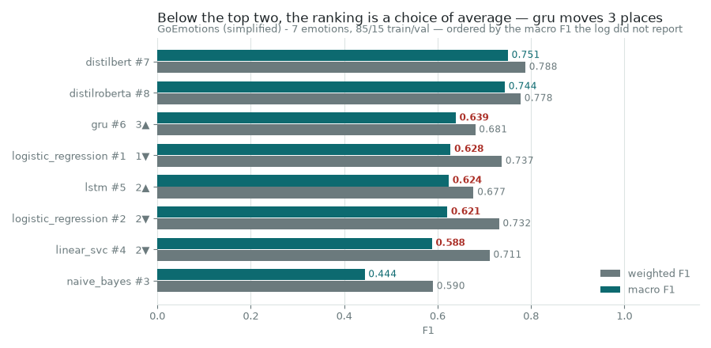

# Model selection

Nine model families were compared before the classifier was chosen. Two records
of that comparison survive, they disagree about which family won, and the
disagreement is the chapter. What the benchmark establishes is narrower than
what was concluded from it, and the gap is measurable from the committed logs
alone.

```bash
uv run emotion-timeline models      # the audit, from both records
```



## The two records

| | Rows | Written by | What it says |
| --- | ---: | --- | --- |
| `submitted-log.json` | 8 | by hand, for submission | DistilBERT wins |
| `run-log.csv` | 101 | by the training script, as it ran | an MLP wins |

Both are committed under `benchmarks/model-selection/`. The run log is the
original file byte for byte; the submitted log is transcribed out of a
spreadsheet, because a binary workbook cannot be read in a diff — its
`_comment` key lists which of its fields are copied and which two are derived.

Neither can be rerun. The runs are gone, and the dataset behind the earliest
third of them is client material that stays out of this repository. So almost
everything below is a cross-check between the two records rather than a
recomputation. The exception is [the seventeen runs that learned
nothing](#seventeen-runs-learned-nothing), which is recomputed exactly.

## The submitted log

Eight rows, all on GoEmotions simplified to seven emotions, split **85/15
train/val**.

That split has no test partition, so every metric in the table below is a
validation score on the same 15% the runs were tuned against. None of them is
quoted anywhere in this repository as the performance of anything.

### The ranking below the top two is a choice of average

The log reported one F1 column and recorded a second one, per row, in its free-text
"other metrics" field. The reported column is the support-weighted average; the
recorded one is the macro average. Ranking by each gives a different table.

| By weighted F1 | | By macro F1 | |
| --- | ---: | --- | ---: |
| distilbert | 0.7879 | distilbert | 0.7505 |
| distilroberta | 0.7778 | distilroberta | 0.7440 |
| logistic_regression #1 | 0.7374 | **gru** | **0.6387** |
| logistic_regression #2 | 0.7316 | logistic_regression #1 | 0.6278 |
| **linear_svc** | **0.7114** | lstm | 0.6239 |
| gru | 0.6806 | logistic_regression #2 | 0.6207 |
| lstm | 0.6771 | **linear_svc** | **0.5879** |
| naive_bayes | 0.5901 | naive_bayes | 0.4439 |

The GRU is sixth on the reported column and third on the one recorded beside it.
The linear SVC is fifth on the first and second-worst on the second. Nothing
about either model changed; the two averages disagree because macro averaging
gives the rare classes the same weight as Joy, and these models are worse on the
rare classes — which
[`error-analysis.md`](error-analysis.md) measures directly.

The top two do not move, so "a transformer won" survives either choice. Anything
below that is an artefact of which column was read.

**How we know which average the reported column is.** The spreadsheet labels its
columns plainly `Precision`, `Recall` and `F1 score` and never says. Recall
averaged over classes weighted by their support is the share of all samples got
right, which is accuracy — an identity that holds for weighted averaging and
fails for macro. Recall equals accuracy in all eight rows, to four decimal
places, which settles it. `check_consistency` asserts that identity, because the
whole finding above depends on the answer.

### The eight rows are not one dataset either

The log's own preprocessing column says how much Neutral each run had to
classify, and it is not the same figure for all eight:

| Neutral capped at | Runs |
| ---: | --- |
| 10,000 | logistic_regression ×2, naive_bayes, linear_svc |
| 6,000 | lstm, gru, distilbert, distilroberta |

The four classical models were given nearly twice as much Neutral as the four
neural ones. Neutral is the class this model family is worst at — a 36.8% error
rate in the error analysis, the worst of the seven — so the share of it in the
evaluation set moves the score, and it moved in the transformers' favour. How far
is not recoverable, which is the point: the margin at the top of the table cannot
be quantified, so it cannot be defended.

## The automatic log

101 runs, 24 September to 23 October 2025, written as the training script went.
It records the metrics and the training time and says nothing whatsoever about
what each run was evaluated on.

### Recovering the evaluation set from the accuracy

An accuracy is a whole number of correct predictions over a whole number of
samples, so the fraction in lowest terms carries a divisor of the evaluation-set
size. 0.508928571 is 57/112; 0.8653125 is 2769/3200. Recovering that divisor is
the only way to see what the log left out.

The recovery is deliberately conservative in two ways.

- It reports a **divisor**, never a size. 0.8625 is exactly 69/80 and is equally
  consistent with 2,760 correct out of 3,200. Everything below is phrased in
  divisors, which costs nothing: two runs whose divisors have no plausible common
  multiple cannot share an evaluation set whatever the true sizes were.
- It **declines** on the 22 rows the log rounded to fewer than seven decimal
  places, 17 of them to exactly four. At that precision the fraction is
  unrecoverable rather than merely imprecise — 0.2796 reads as 699/2500, and
  2,500 is not a set anybody scored.

That leaves 79 of the 101 runs placeable, and they recover **27 distinct
divisors**. The log is not one benchmark. It is at least six, run against the
client's labelled dataset, then against an external corpus, then against
GoEmotions at three different sizes.

### Seventeen runs learned nothing

Here the arithmetic goes the other way and recomputes a result outright. A model
that answers with the majority class for every input gets that class's recall
exactly right and its precision exactly *k/n*, so the class scores 2*k*/(*n*+*k*)
and the other six score zero. Macro averaging then divides by seven, and support
weighting multiplies by *k/n*. No property of the model appears anywhere in it.

For 57 correct out of 112 that gives macro F1 114/1183 = **0.096365173** and
weighted F1 **0.34330093**. Twelve rows of the log carry exactly those two
numbers, to all nine decimal places they were written with — across naive Bayes,
an LSTM, an RNN and XLM-RoBERTa. Four architectures cannot agree to nine
decimals unless they made identical predictions, and the closed form says which
predictions those were: one class, every time.

Seventeen of the 101 runs match the closed form exactly, spread across all three
model types in the log. A sixth of the benchmark is a record of models that had
not learned anything, and nothing in the log marks them as such.

### The claim that does not survive

Sorting the log and reading off the top gives the conclusion the coursework drew:

| | Model | macro F1 | Scored on | Evaluation set |
| --- | --- | ---: | --- | --- |
| Best overall | `pytorch_mlp_gpu` | 0.8219 | "external data only" | a multiple of 3,200 |
| Best transformer | `distilbert` | 0.7515 | "balanced data" | a multiple of 1,889 |

A hand-engineered network beating a transformer by seven points is a good
finding, and it is not what these two rows are. They were never scored on the
same data. 1,889 is prime, so a single evaluation set behind both would need
**6,044,800 samples** — fourteen times the 428,331-row training set this study
builds, from a project whose largest recorded evaluation was a few thousand rows.


Sampling error is not the explanation, and it is worth saying so rather than
reaching for it. The 95% Wilson intervals on the two accuracies are
[0.8530, 0.8767] and [0.7692, 0.8061], and they do not overlap. Something real
separates the two runs. Since they share no evaluation set, what separates them
is what they were scored on.

## The two records do not meet

Every one of the eight submitted macro F1 scores lands near a logged one and none
lands on it. The nearest logged value is between **0.000206 and 0.003228** away.
That is the spread you would expect from running the same configuration again,
and it means the figures that were handed in cannot be traced to any recorded
run.

Matching by value identifies nothing either: three of the eight nearest scores
were not even set by the same kind of model. The submitted LSTM's closest logged
score belongs to a logistic regression.

## Provenance

`Task6` in the group repository originates with **Danil Sysenko**. The logs are
his; the audit, the arithmetic and this chapter are not, and no number here is
quoted forward from his write-up — every one is recomputed or cross-checked from
the two committed files, which is the practice that produced the findings above.

The earliest runs were scored against `data/raw/balanced_dataset.xlsx`, named in
the original `src/config.py`. That file holds labelled transcripts supplied by the
Content Intelligence Agency, so it is not committed here and those runs cannot be
reproduced by anyone. The log's notes column first mentions external data at
iteration 48, and every placeable run before it recovers a divisor of either 112
or 93 — an evaluation set of roughly a hundred rows across seven classes, which
is why so many of them collapsed onto a single answer. After iteration 48 that
stops being true: the divisors climb into the thousands and only one of them,
28, still divides either number.

## What this does not establish

- **That the nine families rank in any particular order.** That is the finding.
  A comparison needs one dataset, one evaluation set and one metric, and this
  benchmark had at least six datasets, 27 evaluation sets and two metrics that
  disagree.
- **That a transformer is the right choice here.** The submitted log is the one
  record where models were scored on a shared corpus, and a transformer wins it
  on both averages. It is also a validation score with no test set, on a corpus
  whose Neutral share differed between the two halves of the table. It points
  the right way and it settles nothing.
- **That the MLP result was wrong.** Its accuracy interval is real and it does
  not overlap the transformer's. What is wrong is the comparison, and the honest
  reading is that the MLP was scored on an easier evaluation set whose difficulty
  nobody recorded.
- **That any of these numbers describes the published model.** None of them does.
  The classifier this study ships is a separate fine-tune on the 428,331-row
  dataset, and its own evaluation is in
  [`error-analysis.md`](error-analysis.md).
- **What a like-for-like comparison would show.** Nothing here reruns anything.
  Rerunning the nine families on one feature pipeline against one held-out split
  is a separate stage with its own committed evaluation, and it would answer a
  different question from the one this chapter asks.
