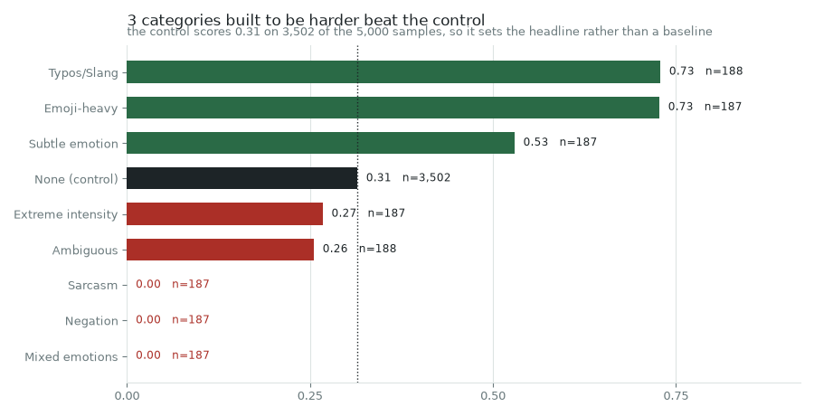

# The model

Two records of the trained classifier survive, and they describe different
models. The card claims DeBERTa-V2-Base evaluated single-label; the committed
training script is DistilBERT evaluated multi-label. The weights are gone from
both university repositories, so nothing here is rerun — what follows is what
each record can support on its own numbers.

```bash
uv run emotion-timeline model      # the audit, from both records
```


## First, the part that holds up

Every figure in all three of the card's evaluation tables reproduces. Each
per-class F1 is the harmonic mean of that row's own precision and recall; each
macro average is the plain mean of its column; weighted F1 and accuracy follow
from the support column. Eighteen class rows across three tables, to the four
decimal places they were written with.

That is worth saying before anything else, because it rules out the dull
explanation. These numbers were computed by something that had the predictions
in front of it. Whatever is wrong below is not sloppy transcription.

| Evaluation | Samples | Accuracy | Macro F1 | Classes scored |
| --- | ---: | ---: | ---: | ---: |
| Held-out validation | 64,250 | 0.8995 | 0.8127 | 7 |
| CARER (external) | 2,000 | 0.9255 | 0.8865 | 5 |
| Synthetic stress test | 5,000 | 0.3144 | 0.2787 | 6 |

The held-out support column is also 15% of the training set's class
distribution, class by class, which is the cross-check
[`dataset.md`](dataset.md) sets out. Two documents written months apart agreeing
to within one row in seven classes is the strongest evidence available that the
card and the error analysis describe the same evaluation.

## The two records are not the same model

### The card's held-out table is single-label

When every prediction is exactly one label, a false positive for one class is
another class's false negative, so micro precision, micro recall and accuracy
are all the same quantity. The card reports **micro F1 0.8995 and accuracy
0.8995**. A thresholded multi-label head has no reason to produce that.

### The script is not

`finetune_transformer.py` sets `problem_type="multi_label_classification"` and
thresholds sigmoid outputs at 0.5. Its own `test_metrics.txt` reports:

```
hamming_loss      0.0357        f1_macro      0.8068
f1_micro          0.8724        precision_macro  0.8775
subset_accuracy   0.8279        recall_macro     0.7550
```

Micro F1 0.8724 against subset accuracy 0.8279 is not something single-label
evaluation can produce, and hamming loss and subset accuracy have no
single-label meaning at all. Its micro F1 does reproduce exactly from its own
micro precision and recall, so this table is internally sound too. It is just a
different table about a different model.

### And the hamming loss says which dataset it trained on

This is the one number in the chapter that is solved for rather than checked.
Over *t* true labels per sample, micro recall fixes the true positives at *tR*
and micro precision fixes the predictions at *tR/P*, so the wrong label slots
per sample come to *t*[(1−*R*) + *R*(1−*P*)/*P*]. Hamming loss is that over the
number of slots, leaving *t* as the only unknown:

**t = 1.025.** About one row in forty carried more than one label.

The dataset the card names, `cleaned_super_dataset.csv`, is single-label by
construction — collapsing multi-label rows to one label by priority order is
[a documented step of the build](dataset.md#the-labels), and it would give
exactly 1. The script's own `DATA_PATH` is `Super-Iter1.parquet`, the
pre-collapse file. So the script trained on the multi-label intermediate, not on
the published dataset.

### The surviving tokenizer settles the architecture

Three files survived the training run. One is a vocabulary of **30,522 tokens** —
exactly `distilbert-base-uncased`. The card claims a **128,100-token
SentencePiece** vocabulary, which is DeBERTa-V2's.

So the card's architecture section describes a model whose tokenizer is not the
one the surviving run produced. Either the card documents a later model nothing
else survives of, or its architecture section is wrong. Both are consistent with
everything committed here, and this chapter does not choose between them.

## The card's dataset table has its labels on the wrong rows

Its class counts are correct. They are precisely the state this repository's own
build passes through after dropping Love and before the priority collapse, plus
the 9,151 synthetic Disgust rows. The labels attached to them are not.

| Count | The card says | It is actually |
| ---: | --- | --- |
| 149,321 | Neutral | **Joy** |
| 127,866 | Happiness | **Sadness** |
| 63,532 | Anger | Anger |
| 54,041 | Sadness | **Fear** |
| 16,075 | Surprise | Surprise |
| 13,401 | Fear | **Neutral** |

The labels were attached to a descending-sorted column of counts. Anger and
Surprise are right by coincidence — they hold the same rank under both
assignments. The other four are shifted.

**The card refutes itself.** Its dataset table calls Joy's 149,321 rows Neutral.
Its performance table, for the same model on the same data, gives Neutral a
support of 2,010 — which is 15% of 13,401, not of 149,321. The support column
agrees with the corrected assignment in all seven classes and with the dataset
table in none of the four it got wrong.

The consequence is not cosmetic. The card's limitations section reasons from the
broken table: *"the dataset is skewed toward neutral and happiness labels, which
may cause the model to underperform on low-frequency emotions like fear and
disgust."* Neutral is the **smallest** class at 3.1%, and it is the class the
model is worst at — a 36.8% error rate. The diagnosis inverts the actual
problem. It also spreads: the plan this rebuild was written from quoted the
broken distribution verbatim, and so would anyone else reading the card.

## The stress test does not measure what it was built to measure



Five thousand synthetic adversarial samples, reported as 31.44% accuracy and a
0.2787 macro F1. Four things are wrong with reading that as a robustness result.

**The macro average is over six classes, not seven.** Surprise is absent from
the table. Over all seven the figure is **0.2389**, not 0.2787.

**The control group is harder than the manipulations.** Untouched control text
scores 0.3147 while emoji-heavy scores 0.7273, typo-laden 0.7287 and
deliberately subtle 0.5294. Three categories built to break the model beat the
condition they were meant to be compared against. A control that is harder than
the treatment is not a baseline.

**The headline is the control's own score.** The control is 3,502 of the 5,000
samples, so the overall 0.3144 is essentially the control's 0.3147 with the rest
rounding into it. The reported number describes the generator's ordinary output,
not any adversarial property.

**Three categories score exactly zero.** Sarcasm, negation and mixed emotions:
561 samples, not one correct. Uniform guessing over seven classes lands about
one in seven. Exactly 0.0000 three times is a label-space or mapping problem, not
a model finding. The card reads it as *"complete breakdown on sarcasm"*, which
would be a real result if the zeros were real.

One narrative figure also fails to follow from the table. The card reports
**2,753** Disgust false positives. With 227 true Disgust samples and a precision
printed as 0.0763, the predictions are pinned to 2,973–2,977 and the false
positives to **2,746–2,750**. 2,753 is outside that. Small, and it means the
number came from somewhere other than the table beside it.

## Calibration is the thing that degrades first

| | Correct | Incorrect | Gap |
| --- | ---: | ---: | ---: |
| Held-out | 0.8873 | 0.4275 | **0.460** |
| CARER | 0.9176 | 0.7082 | 0.209 |
| Synthetic | 0.5133 | 0.5321 | **−0.019** |

In domain, confidence separates right from wrong cleanly enough to threshold on.
On an external corpus the gap halves. On the synthetic set it inverts — wrong
answers are *more* confident than right ones — so a confidence threshold there
selects against correctness. The card's advice to use ≥ 0.7 holds only for the
first row.

## Provenance

`Task11/Model_card.md` is a group deliverable; `finetune_transformer.py` and its
metrics are from the individual block. Neither is quoted forward: every number
above is recomputed from the two committed transcriptions in
`benchmarks/model/card-metrics.json`, which is what surfaced the mislabelled
table and the six-class average.

The weights are absent from both repositories. What survives of the training run
is `test_metrics.txt`, `training_args.bin` and `vocab.txt` — no checkpoint, so no
prediction can be reproduced and no metric re-derived from data. That is why this
stage audits rather than evaluates, and why the plan's intention to ship weights
as a release asset with a recorded digest cannot be carried out: there is nothing
to ship.

## What this does not establish

- **That the model is worse than the card says.** The held-out table reproduces
  and cross-checks against the dataset build. On its own terms the in-domain
  result stands.
- **Which architecture was actually trained.** The tokenizer says DistilBERT and
  the card says DeBERTa-V2. One record is wrong and the committed evidence does
  not say which.
- **That the model is robust or not robust.** The stress test is the only
  evidence either way and it is not usable for it. The question is open.
- **Anything about sarcasm or negation.** Three zero-accuracy categories are a
  bug to be explained, not a measurement.
- **That retraining would reproduce any of this.** The dataset rebuilds exactly
  ([`dataset.md`](dataset.md)), so a fresh fine-tune is possible, but it would be
  a new model with new numbers and would not settle what these records say.
  [`fine-tune.md`](fine-tune.md) is that model: it beats this table on five of the
  six classes comparable to it, and settles none of the questions above.
