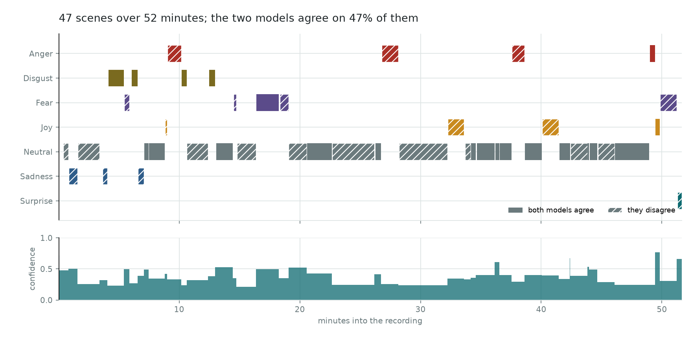

# The pipeline: a real recording, scene by scene

Every other chapter here measures something against ground truth. This one cannot:
a 51-minute documentary about Manaus and the Brazil–Colombia border has no labels,
and nobody is going to annotate it. So the question it can answer is not *how
accurate is this* — unanswerable — but **how much of this timeline is the
recording, and how much is the machinery**. That turns out to be measurable
without a single label, and the answer is less flattering than the picture.

```bash
uv run emotion-timeline timeline --against benchmarks/pipeline/timeline-whisper.json
uv run emotion-timeline score-timeline   # reruns both models over the transcript
```



## The seam

```
 optional, --extra stt, never in CI
   video ──► yt-dlp ──► ffmpeg 16 kHz mono ──► whisper large-v3-turbo
                                                       │
                                        segments.csv ◄──┘   start_s, end_s, text
                                                       │
 always reproducible, no network, tested  ─────────────┤
                                                       ▼
      scene grouping ──► chunking ──► classify ──► calibrate ──► timeline.csv + .png
```

Three columns are the whole interface. Everything above them needs a network, a
GPU and a few hundred megabytes of audio nobody should commit; everything below
them runs from a committed CSV. Whatever replaces Whisper in 2027 has to write
those three columns and nothing else.

## Three components replaced by one parameter each

The original pipeline had a visual scene detector, a separate intensity
classifier, and an HTTP call to a local LLM for translation. None survived, and
each replacement is smaller than the thing it replaced.

**Scenes come from silence.** The original ran PySceneDetect over the video to
find visual cuts. At this layer there is no video and none is needed: consecutive
segments with less than one second of silence between them are one scene. That
gives 47 scenes with a median length of 51 seconds; two seconds gives 31 at 83
seconds, and five gives ten, which is a chapter list rather than a timeline. The
threshold is one flag, it is recorded, and a reader can check it against the
transcript by eye — three things PySceneDetect was not.

**Intensity is the calibration.** The original gated each emotion behind a
separate intensity model trained on nothing anybody could check. A temperature
fitted on held-out validation rows answers the same question — which scenes to
believe — with a number behind it and one fewer untested component. The strip
under the timeline is that number.

**Translation is a pinned artefact.** `Helsinki-NLP/opus-mt-ru-en`, greedy
decoding, no beams. The original called a local LLM server with a configurable
model name, which cannot be pinned and therefore cannot be checked a year later.

## The classification unit is a chunk, not a transcript row

This one came out of running the pipeline twice and is the most useful thing on
the page.

Ask the models about whatever rows the transcriber emitted, and part of every
answer is the transcriber. The same recording through Whisper rather than
AssemblyAI came back **87% Neutral against 68%** — Whisper splits on pauses where
AssemblyAI merges into paragraphs, and a lone sentence reads as neutral where the
paragraph it came from does not.

So each scene's text is repacked into chunks of at most **400 characters**,
splitting between whole segments where possible and between sentences where a
single segment is too long. The budget is measured rather than guessed: at this
corpus's worst observed rate ruBERT spends 0.298 tokens per character, so 400
characters is 119 of its 128 and 140 of the translator's 192, and **nothing is
truncated**. 316 segments become 142 chunks; Whisper's 947 become 132.

**It did not make the two transcripts agree**, which is the honest half. It
removes one known reason for them not to.

## How much of this is the transcriber?

Two transcripts of the same 51 minutes, the same pipeline over both:

| | AssemblyAI | Whisper large-v3-turbo |
| --- | ---: | ---: |
| Segments | 316 | 947 |
| Scenes | 47 | 54 |
| Chunks | 142 | 132 |
| Neutral, by runtime | 66.4% | 44.0% |
| The two models agree | 46.8% | 42.6% |

**They put the same emotion on 62.0% of the 2,740 seconds both cover.** Not 95%,
and not noise either. Two-thirds of the disagreement is one-directional —
AssemblyAI Neutral where Whisper is not — and the largest single move is 274
seconds of Neutral becoming Fear.

That is a number no accuracy figure would have shown, it needed no labels, and it
is the ceiling on how precisely any claim about this recording can be made. It is
recomputable: both transcripts and both timelines are committed, and
`emotion-timeline timeline --against` prints it.

## What it found

| | |
| --- | ---: |
| Segments | 316 |
| Scenes, at a 1s silence gap | 47 |
| Recording | 51.6 minutes |
| Scenes the two models agree on | 22 (46.8%) |
| Median calibrated confidence | 0.382 |

**Just over half the episode is Neutral**, which is the correct answer for
narration: a presenter explaining that Manaus sold rubber and is ringed by jungle
is not an emotional beat, and a timeline that found one would be wrong. The 21
scenes that are not Neutral land where the episode turns:

| At | | Confidence | Agreed | |
| ---: | --- | ---: | :-: | --- |
| 3.7m | **Sadness** | 0.3210 | | a killing, and what it says about the neighbourhood |
| 6.1m | **Disgust** | 0.2665 | ✓ | walking away from the murder scene |
| 12.5m | **Disgust** | 0.3817 | ✓ | cocaine, *"people prefer to stay quiet, because they want to live"* |
| 16.4m | **Fear** | 0.4982 | ✓ | *"I understood why they will not talk about it"* |
| 49.5m | **Joy** | **0.7691** | ✓ | *"thank you for the interview, for the courage, for the candour"* |
| 51.3m | **Surprise** | 0.6585 | | *"an interesting day. Busy. And now I can finally relax"* |

The 49.5-minute scene is the most confident non-Neutral reading in the episode and
both models agree on it. The three least confident, at 0.2297, 0.2370 and 0.2458, are
agreed too — which is the clearest reminder available that agreement is not
confidence, and that neither is accuracy.

**One is plainly wrong**, and it is worth naming: at 37.6 minutes *"oh, brilliant!
And they are handing out sweets!"* comes back **Anger**. The two models split on
it, so the picture hatches it, which is the entire argument for carrying a second
opinion at all.

### The second opinion has a tell

A predicts **Disgust on 17 of 47 scenes**; B predicts it on 4. On a recording
about drug trafficking Disgust is not an absurd answer, but seventeen times is not
a reading of the material — it is a systematic lean, from the model that scored
0.3631 on ru-izard against B's 0.4816. Given that, the sensible use of A is as a
dissent signal rather than a vote, which is what it is.

### Agreement and confidence move together, slightly

Scenes the two models agree on carry a mean calibrated confidence of **0.422**
against **0.377** where they split. Two signals never fitted to each other point
the same way. It is mild corroboration that agreement tracks something, and the
gap is small enough that it is worth no more than that.

## Running it on a video of your own

```bash
uv sync --extra stt --extra model
uv run emotion-timeline transcribe "<url or file>" --out data/segments.csv
uv run emotion-timeline score-timeline --segments data/segments.csv --out mine.json
uv run emotion-timeline timeline --record mine.json --segments data/segments.csv
```

`transcribe` is the only command in this repository that needs a network, and the
only one carrying `# pragma: no cover`. It downloads audio with yt-dlp, converts
it to 16 kHz mono with ffmpeg, runs Whisper large-v3-turbo and writes the three
columns. On this 51-minute recording that took 5 minutes 39 seconds end to end,
including fetching the model. Nothing it produces is committed: `downloads/` and
`data/` are both gitignored, because the upstream repository carries about 700 MB
of YouTube audio and that is the mistake not to repeat.

`--language ru` is passed rather than detected. Auto-detection reads the first
thirty seconds, so a recording that opens on music or a title card can come back
as the wrong language and transcribe into it without complaining.

## What this does not establish

- **Not an accuracy.** There are no labels on this recording. 46.8% is a
  consistency figure between two models, and 62.0% a consistency figure between
  two transcripts. Two models can agree and both be wrong, and on out-of-domain
  text they will do that more often than the ru-izard number suggests.
- **The models are not independent.** Both were scored on ru-izard, B was trained
  on it, and A ends in a model trained to the same seven-class collapse. Their
  errors correlate more than "two opinions" implies.
- **The confidences are low, and that is the honest reading.** A median of 0.382
  after calibration says the model is rarely sure on documentary speech. It is
  trained on social-media register and this is narration, and the temperature
  itself was fitted on ru-izard — so even the calibration is borrowed.
- **Two transcripts is not a distribution.** 62.0% is one pair. A third
  transcriber could sit anywhere, and the comparison also confounds the
  transcript with the scene boundaries, since the two do not pause in the same
  places. The number is a floor on the sensitivity, not a measurement of it.
- **The scene boundaries are silences, not scenes.** A presenter pausing for
  breath and a hard cut to a different location look identical from a transcript.
- **The AssemblyAI transcript's 0.81% word error rate** was measured over an
  eighteen-minute window, not all 51. Errors outside it propagate here silently.
