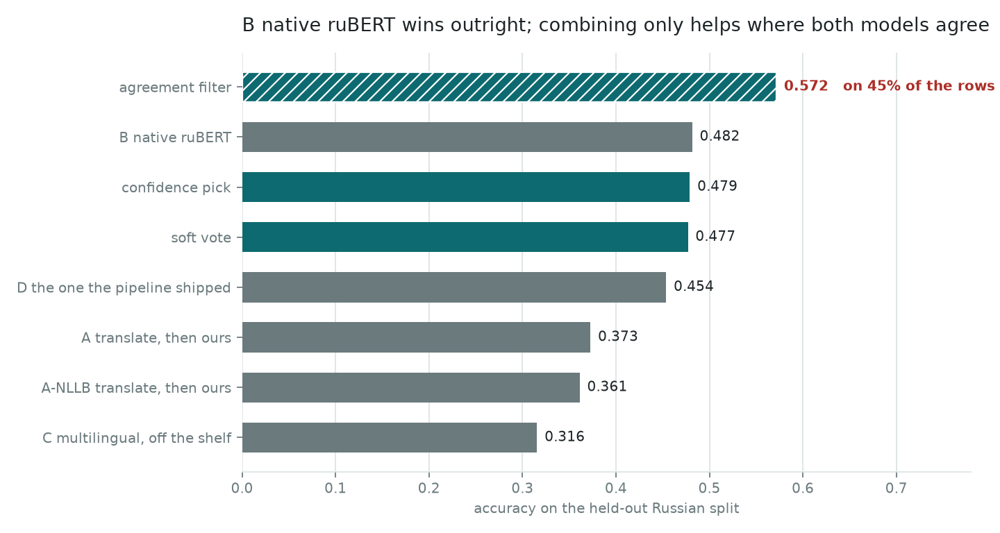

# Russian: translate, or classify it directly?

The pipeline this project is named for reads Russian. Everything else here is
trained on English. The original coursework resolved that by judgement — there
was no good Russian emotion dataset, so translate — and never scored the decision
against anything.

```bash
uv run emotion-timeline russian            # reads only committed records
uv run emotion-timeline compare-russian    # reruns every approach
uv run emotion-timeline translation-cost   # prices translation on its own
```



> **This chapter was rewritten after an audit.** An earlier version reported
> approach A at 0.3631 and concluded that "classifying Russian directly beats
> translating it by twelve points, so the original's judgement was wrong". Two
> things were wrong with that. The translation harness was **dropping sentences**,
> so the number was partly measuring a bug; and the conclusion was stated about
> *translation* when the evidence only supports a statement about **this corpus**.
> Both are fixed below, and the corrected reading is weaker and more useful.

## The set, and what it actually is

[`Djacon/ru-izard-emotions`](https://huggingface.co/datasets/Djacon/ru-izard-emotions),
24,891 rows in, **24,766** out.

| Step | Rows | |
| --- | ---: | --- |
| load | 24,891 | every split, concatenated |
| deduplicate | 24,853 | −38 |
| drop unlabelled | 24,766 | −87, once `guilt` and `shame` go |

**It is DeepL-translated GoEmotions.** The dataset card says so: the corpus was
built by machine-translating GoEmotions and a Kaggle emotion set into Russian and
relabelling to ten Izard-inspired classes. That single fact decides how far
anything measured on it can be carried, and it comes back in every section below.

`guilt` and `shame` have no seven-class home and the original dropped them too,
which is the only reason the two builds are comparable at all.

**`enthusiasm` is the real decision, and it is four times smaller than it looks.**
5,185 rows carry the column — 21% of the set — so merging it into Joy reads like a
large intervention. It is not: only **1,115** rows actually change class, because
the rest already carry a label the priority collapse prefers. `--drop-enthusiasm`
builds the other version, 1,115 rows shorter with Joy at 3,467 instead of 4,582.

### The distribution is a confound, before any model runs

| | This set | The English training set |
| --- | ---: | ---: |
| Neutral | **31.3%** | **3.2%** |

Ten times the share, on the class our model is already worst at — a 43% error rate
in [`fine-tune.md`](fine-tune.md). A test asserts both shares so the point cannot
quietly go missing.

## Five approaches, 3,715 held-out rows

| | | Accuracy | Macro F1 |
| --- | --- | ---: | ---: |
| **A** | translate with `opus-mt-ru-en`, then our `distilbert-v1` | 0.3728 | 0.3443 |
| **A-NLLB** | translate with `nllb-200-distilled-600M` instead | 0.3612 | 0.3291 |
| **B** | `rubert-base-cased` fine-tuned here | **0.4816** | **0.4640** |
| **C** | `tabularisai/multilingual-emotion-classification`, off the shelf | 0.3157 | 0.2826 |
| **D** | `Djacon/rubert-tiny2`, the one the pipeline shipped | 0.4538 | 0.3945 |

**On this corpus, classifying Russian directly beats translating it by eleven
points**, and it also beats the model the pipeline actually shipped. D carries an
advantage that cannot be stripped from it — it reports ru-izard's own ten columns,
which is the tell that it was **trained on the corpus this scores it against**, so
0.4538 is an upper bound rather than a measurement. That caveat lives in the
record beside the number.

C's 0.3157 comes with its own discount: **20% of its top answers** were a class our
label map could only approximate. A prediction we refuse to map is scored wrong
regardless, which measures our map rather than the model — so it is mapped, and
the share is published.

### The bug that made the first version of this table wrong

`opus-mt` is a **sentence-level** model. Handed two sentences it routinely
translates the first and emits end-of-sequence, and nothing in the output says so.
The first version of this chapter fed it whole rows:

| | |
| --- | ---: |
| Rows with more than one sentence | 1,586 of 3,715 |
| Of those, returned with sentences missing | **1,398 (88.1%)** |
| Rows that lost more than a quarter of their characters | 954 (25.7%) |

Splitting on sentence boundaries first and rejoining afterwards fixes it, and
cleaning the output the way the training set was cleaned costs nothing either way.
Together they move A from **0.3631 to 0.3728**. A real bug, a real correction, and
**it does not change the ranking** — which is worth saying plainly, because it
would have been easy to report the fix as though it had.

## What translation costs, measured on its own

The comparison above cannot separate translation from domain from label
conventions: A and B are scored on the same rows, but A's number carries all
three. So here is the same question with everything except translation held
fixed — and it needs no Russian ground truth at all.

Take the model's **own English held-out rows**, push them through English →
Russian → English, and score them again. Same domain, same labels, same
annotator, same model.

| | Accuracy | Macro F1 | Cost |
| --- | ---: | ---: | ---: |
| The English rows themselves | **0.9180** | 0.8009 | |
| after `opus-mt` round trip | 0.5480 | 0.4399 | **−0.3700** |
| after `NLLB-600M` round trip | 0.5750 | 0.4470 | **−0.3430** |

**Translation costs this classifier a third of its accuracy**, on text where
nothing else has changed. That is the number the earlier version of this chapter
should have reported instead of putting 0.9164 and 0.4816 side by side, which are
different corpora and were never comparable.

**And a much better translator barely helps.** NLLB-600M is roughly six times the
size of the opus-mt pair and trained on 200 languages. It recovers **0.0270 of the
0.3700** — about seven per cent of the loss. On the Russian set itself it does not
help at all: A-NLLB scores 0.3612 against A's 0.3728. So the loss is not the
translator's quality. It is the paraphrase.

The obvious explanation is ruled out too. `error-analysis.md` found this model
leans on surface markers, and translation rewrites punctuation freely — but the
markers **survive**:

| Share of rows carrying | Original | opus-mt | NLLB |
| --- | ---: | ---: | ---: |
| ALL-CAPS word | 1.17% | 0.83% | 1.60% |
| Exclamation mark | 3.43% | 3.23% | 3.17% |
| Question mark | 2.13% | 2.43% | 2.83% |

They move by a few tenths of a point while accuracy moves by thirty-seven. Whatever
the model is keyed on, a meaning-preserving rewrite destroys it, and that says
more about the 0.9164 than it does about translation. A round trip is two passes
where the pipeline makes one, so these are upper bounds — the one-way cost is
smaller, and still large.

## Why this cannot settle the question the pipeline asks

This is the part the first version got wrong, and it follows entirely from what
ru-izard is.

The corpus is **English text that DeepL translated into Russian**. So on this
benchmark:

- **Approach A translates twice.** English → Russian by DeepL, then Russian →
  English by opus-mt. It is scored on a round trip, which the table above prices
  at roughly a third of the model's accuracy.
- **Approach B trains and tests on the same translationese.** Its training rows and
  its test rows came out of the same machine translator, so whatever artefacts
  that leaves are signal it can learn.

The pipeline's real input is neither. It is **native Russian speech** — a
presenter talking — which A would translate once and B has never seen. The
benchmark is therefore biased towards B by construction, and by an amount nothing
here can measure.

So the defensible claim is: **on ru-izard, a native model beats a translated
one.** The claim the earlier version made — that the coursework's judgement to
translate was wrong — is **not supported**, and this chapter no longer makes it.

## Does cross-validating two models help?

`Task12/emotion_classifier_ru.py` ends with *"Next stage: Cross-validation between
multiple emotion models (future)"*. It was never built, and could not have been
settled: there was no Russian ground truth to settle it against.

Only A and B can be combined — both answer in our seven classes, so their
probabilities are comparable once each is scaled by its own temperature, fitted on
its own validation rows. **A's temperature is 2.591 and B's is 1.235**: the
translated pipeline is far more overconfident.

| Rule | Accuracy | Macro F1 | Coverage |
| --- | ---: | ---: | ---: |
| soft vote | 0.4770 | 0.4591 | all |
| confidence pick | 0.4791 | 0.4581 | all |
| **agreement filter** | **0.5718** | **0.5318** | **44.6%** |

**The ensemble does not raise accuracy, and that is the finding.** Both
full-coverage rules land below B alone. Averaging a 0.37 model into a 0.48 one
drags it down, and picking by confidence does no better because the weaker model
is the more confident one.

**Where combining pays is as a filter.** On the 44.6% of rows where A and B pick
the same class, accuracy is 0.5718 — nine points above either alone. Not a better
model: a *believe this one / look at that one* signal, which is what the timeline
uses it for. The coverage is published with the accuracy every time, and
`check_consistency` refuses a record carrying one without the other.

## What this does not establish

- **That translation is the wrong choice for the pipeline.** ru-izard makes the
  translated approach translate twice and lets the native one train on its own
  test distribution. On native Russian speech neither handicap applies, and
  nothing here measures that case.
- **That any of these numbers describes the pipeline's accuracy.** ru-izard is
  social-media register; the documentary is not.
- **That D is worse than B.** D's number is an upper bound on a corpus it was
  trained on, and it still loses. That is a stronger statement than the table
  looks.
- **That the agreement filter is worth its coverage.** Whether answering 45% of
  segments at 0.57 beats answering all of them at 0.48 is a product decision.
- **Anything about a model trained on more Russian data**, or on Russian that was
  not machine-translated. 24,766 rows of translationese is what exists, and the
  experiment that would settle the chapter's central question — native Russian,
  natively annotated — cannot be run.
